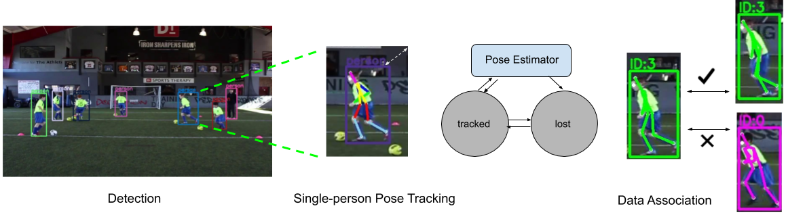
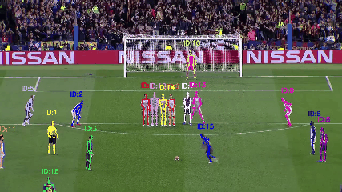

<p align="center">

</p>

## LightTrack: A Generic Framework for Online Top-Down Human Pose Tracking

### Update 5/16/2019: Add Camera Demo

[[Project Page](http://guanghan.info/projects/LightTrack)] [[Paper](https://arxiv.org/pdf/1905.02822.pdf)] [[Github](http://github.com/Guanghan/lighttrack)]
[](https://paperswithcode.com/sota/pose-tracking-on-posetrack2017?p=lighttrack-a-generic-framework-for-online-top)


**With the provided code, you can easily:**
- **Perform online pose tracking on live webcam.**
- **Perform online pose tracking on arbitrary videos.**
- **Replicate ablation study experiments on PoseTrack'18 Validation Set.**
- **Train models on your own.**
- **Replace pose estimators or improve data association modules for future research.**


#### Real-life Application Scenarios:
- [Surveillance](https://youtu.be/P9Bzs3cSF-w) / [Sport analytics](https://youtu.be/PZVGYmr7Ryk) / Security / Self-driving / Selfie video / Short videos (Douyin, Tiktok, etc.)

## Table of Contents
- [LightTrack](#LightTrack)
  * [Table of Contents](#table-of-contents)
  * [Overview](#overview)
  * [Prerequisites](#Prerequisites)
  * [Getting Started](#getting-started)
    * [Demo on Live Camera](#Demo-on-Live-Camera)
    * [Demo on Arbitrary Videos](#Demo-on-Arbitrary-Videos)
    * [Validate on PoseTrack 2018](#validate-on-posetrack-2018)
    * [Evaluation on PoseTrack 2018](#evaluation-on-posetrack-2018)
  * [Qualitative Results](#qualitative-results-on-posetrack)
  * [Quantitative Results](#quantitative-results-on-posetrack)
    * [Performance on PoseTrack 2017 Benchmark (Test Set)](#quantitative-results-on-posetrack)
  * [Training](#training)
    * [Pose Estimation Module](#1-pose-estimation-module)
    * [Pose Matching Module: SGCN](#2-pose-matching-module)
  * [Limitations](#limitations)
  * [Citation](#citation)
  * [Reference](#reference)
  * [Contact](#contact)

## Overview
LightTrack is an effective light-weight framework for human pose tracking, truly online and generic for top-down pose tracking.
The code for [the paper](https://arxiv.org/pdf/1905.02822.pdf) includes LightTrack framework as well as its replaceable component modules, including detector, pose estimator and matcher, the code of which largely borrows or adapts from [Cascaded Pyramid Networks](https://github.com/chenyilun95/tf-cpn) [[1]], [PyTorch-YOLOv3](https://github.com/eriklindernoren/PyTorch-YOLOv3), [st-gcn](https://github.com/yysijie/st-gcn) and [OpenSVAI](https://doc-opensvai.readthedocs.io/en/latest/) [[3]].



In contrast to **Visual Object Tracking** (VOT) methods, in which the visual features are implicitly represented by kernels or CNN feature maps, we track each human pose by recursively updating the bounding box and its corresponding pose in an explicit manner. The bounding box region of a target is inferred from the explicit features, i.e., the human keypoints. Human keypoints can be considered as a series of special visual features.
The advantages of using pose as explicit features include:

* (1) The explicit features are human-related and interpretable, and have very strong and stable relationship with the bounding box position. Human pose enforces direct constraint on the bounding box region.

* (2) The task of pose estimation and tracking requires human keypoints be predicted in the first place. Taking advantage of the predicted keypoints is efficient in tracking the ROI region, which is almost free. This mechanism makes the online tracking possible.

* (3) It naturally keeps the identity of the candidates, which greatly alleviates the burden of data association in the system. Even when data association is necessary, we can re-use the pose features for skeleton-based pose matching.
(Here we adopt **Siamese Graph Convolutional Networks (SGCN)** for efficient identity association.)

**Single Pose Tracking** (SPT) and **Single Visual Object Tracking** (VOT) are thus incorporated into one unified functioning entity, easily implemented by a replaceable single-person human pose estimation module.
Below is a simple step-by-step explanation of how the LightTrack framework works.


(1). Detection only at the 1st Frame. Blue bboxes indicate tracklets inferred from keypoints.


(2). Detection at every other 10 Frames. Red bbox indicates keyframe detection.


(3). Detection at every other 10 Frames for multi-person:
* At non-keyframes, IDs are naturally kept for each person;
* At keyframes, IDs are associated via spatial consistency.

For more technical details, please refer to our arXiv paper.

## Prerequisites
 - Set up a Python3 environment with provided anaconda environment file.
   ```Shell
   # This anaconda environment should contain everything needed, including tensorflow, pytorch, etc.
   conda env create -f environment.yml
   ```
### (Optional: set up the environment on your own)
 - Install [PyTorch](http://pytorch.org/) 1.0.0 (or higher) and TorchVision. (Siamese Graph Convolutional Network)
 - Install [Tensorflow](https://www.tensorflow.org/install) 1.12. Tensorflow v2.0 is not tested yet. (Human Pose Estimator)
 - Install some other packages:
   ```Shell
   pip install cython opencv-python pillow matplotlib
   ```

## Getting Started
 - Clone this repository and enter the ~~dragon~~ lighttrack folder:
   ```Shell
   git clone https://github.com/Guanghan/lighttrack.git;

   # build some necessities
   cd lighttrack/lib;
   make;

   cd ../graph/torchlight;
   python setup.py install

   # enter lighttrack
   cd ../../

   ```
 - If you'd like to train LightTrack, download the [COCO dataset](http://cocodataset.org/#download) and the [PoseTrack dataset](https://posetrack.net/users/download.php) first. Note that this script will take a while and dump 21gb of files into `./data/coco`. For PoseTrack dataset, you can replicate our ablation experiment results on the validation set. You will need to register at the official website and create entries in order to submit your test results to the server.
   ```Shell
   sh data/download_coco.sh
   sh data/download_posetrack17.sh
   sh data/download_posetrack18.sh
   ```

### Demo on Live Camera

| PoseTracking Framework | Keyframe Detector | Keyframe ReID Module | Pose Estimator | FPS |
|:----------:|:-----------:|:--------------:|:----------------:|:---------:|
| LightTrack | YOLOv3 | Siamese GCN | MobileNetv1-Deconv | 220* / 15 |

 - Download weights.
   ```Shell
   cd weights;
   bash ./download_weights.sh  # download weights for backbones (only for training), detectors, pose estimators, pose matcher, etc.
   cd -;
   ```

 - Perform pose tracking demo on your Webcam.
   ```Shell
   # access virtual environment
   source activate py36;

   # Perform LightTrack demo (on camera) with light-weight detector and pose estimator
   python demo_camera_mobile.py
   ```


### Demo on Arbitrary Videos


| PoseTracking Framework | Keyframe Detector | Keyframe ReID Module | Pose Estimator | FPS |
|:----------:|:-----------:|:--------------:|:----------------:|:---------:|
| LightTrack | YOLOv3 | Siamese GCN | MobileNetv1-Deconv | 220* / 15 |

 - Download demo video.
   ```Shell
   cd data/demo;
   bash ./download_demo_video.sh  # download the video for demo; you could later replace it with your own video for fun
   cd -;
   ```

 - Perform online tracking demo.
   ```Shell
   # access virtual environment
   source activate py36;

   # Perform LightTrack demo (on arbitrary video) with light-weight detector and pose estimator
   python demo_video_mobile.py
   ```
 - After processing, pose tracking results are stored in standardized OpenSVAI format JSON files, located at [**data/demo/jsons/**].

 - Visualized images and videos have been output at [**data/demo/visualize/**] and [**data/demo/videos/**]. Note that the video is by default output with the actual average framerate. You can hardcode it to be faster or slower for different purposes.

 - Some statistics will also be reported, including FPS, number of persons encountered, etc. Below is the statistics with the provided video, using YOLOv3 as detector and MobileNetv1-Deconv as the pose estimator.

  ```Shell
  total_time_ALL: 19.99s
  total_time_DET: 1.32s
  total_time_POSE: 18.63s
  total_time_LIGHTTRACK: 0.04s
  total_num_FRAMES: 300
  total_num_PERSONS: 600

  Average FPS: 15.01fps
  Average FPS excluding Pose Estimation: 220.08fps
  Average FPS excluding Detection: 16.07fps
  Average FPS for framework only: 7261.90fps
  ```

You can replace the demo video with your own for fun. You can also try different detectors or pose estimators.

### Validate on PoseTrack 2018

Pose estimation models have been provided. It should have been downloaded to `./weights` folder while running `./download_weights.sh` script.
We provide alternatives of CPN101 and MSRA152, pre-trained with ResNet101 and Res152, respectively.

| Image Size | Pose Estimator      |  Weights                                                                                 |
|:----------:|:-------------:|------------------------------------------------------------------------------------------------|
| 384x288        | CPN101 [[1]] | [CPN_snapshot_293.ckpt](http://guanghan.info/download/Data/LightTrack/weights/CPN101.zip)   |
| 384x288        | MSRA152 [[2]] | [MSRA_snapshot_285.ckpt](http://guanghan.info/download/Data/LightTrack/weights/MSRA152.zip)|

Detections for PoseTrack'18 validation set have been pre-computed. We use the same detections from [[3]] in our experiments.
Two options are available, including deformable versions of FPN and RFCN, as illustrated in [the paper](https://arxiv.org/abs/????).  
Here we provide the detections by FPN, which renders higher performance.   

|  Detector      |        Jsons                                                                                                        |
|:-------------:|----------------------------------------------------------------------------------------------------------------|
| ResNet101_Deformable_FPN_RCNN [[6]]  | [DeformConv_FPN_RCNN_detect.zip](http://guanghan.info/download/Data/LightTrack/dets/DeformConv_FPN_RCNN_detect.zip)   |
| ResNet101_Deformable_RFCN [[6]] | DeformConv_RFCN_detect.zip |
| Ground Truth Locations | [GT_detect.zip](http://guanghan.info/download/Data/LightTrack/dets/GT_detect.zip) |


 - Download pre-computed detections and unzip them in `./data` directory.
    ```Shell
    cd data;
    bash ./download_dets.sh   
    cd -;
    ```

 - Perform LightTrack on PoseTrack 2018 validation with our detection results using deformable FPN.
   ```Shell
   python process_posetrack18_with_lighttrack_MSRA152.py
   # or
   python process_posetrack18_with_lighttrack_CPN101.py
   ```

 - Or perform LightTrack on PoseTrack 2018 validation with ground truth locations.
   ```Shell
   python process_posetrack18_with_lighttrack_MSRA152_gt.py
   # or
   python process_posetrack18_with_lighttrack_CPN101_gt.py
   ```

 - After processing, pose tracking results are stored in standardized OpenSVAI format JSON files, located at [**data/Data_2018/posetrack_results/lighttrack/results_openSVAI/**].

 - Visualized images and videos have been output at [**data/Data_2018/videos/**].

### Evaluation on PoseTrack 2018

 - If you'd like to evaluate LightTrack predicted using detection results.
   ```Shell
   # Convert tracking results into PoseTrack format before evaluation
   source activate py36;
   python jsonformat_std_to_posetrack18.py -e 0.4 -d lighttrack -m track -f 17 -r 0.80;  # validation set. For DET locations

   # Evaluate Task 1/2 + 3: using official poseval tool
   source deactivate;
   cd data/Data_2018/poseval/py && export PYTHONPATH=$PWD/../py-motmetrics:$PYTHONPATH;
   python evaluate.py \
    --groundTruth=/export/LightTrack/data/Data_2018/posetrack_data/annotations/val/ \
    --predictions=/export/LightTrack/data/Data_2018/predictions_lighttrack/ \
    --evalPoseTracking \
    --evalPoseEstimation;
   ```

For mAP, two values are given: the mean average precision before and after keypoint dropping.
For FPS, * means excluding pose inference time. Our LightTrack in true online mode runs at an average of 0.8 fps on PoseTrack'18 validation set.

[LightTrack_CPN101] and [LightTrack_MSRA152] are both trained with [COCO + PoseTrack'17] dataset;
[LightTrack_MSRA152 + auxiliary] is trained with [COCO + PoseTrack'18 + ChallengerAI] dataset.

| Methods       | Det Mode | FPS  |  mAP  | MOTA  |  MOTP |                                                                                               
|:-------------:|:----:|:----:|:----:|:----:|:----:|
| LightTrack_CPN101  |online-DET-2F| 47* / 0.8 | 76.0 / 70.3 | **61.3** | 85.2 |
| LightTrack_MSRA152   |online-DET-2F| 48* / 0.7 | 77.2 / 72.4  | **64.6** | 85.3 |
| LightTrack_MSRA152 + auxiliary   |online-DET-2F| 48* / 0.7 | 77.7 / 72.7 | **65.4** | 85.1  |


 - If you'd like to evaluate LightTrack predicted using ground truth locations. Note that for ground truth locations, not every frame is annotated. If a keyframe is not annotated, the estimation is missing. In order to successfully evaluate the performance, we generate ground truth jsons (**gt_locations**) specially for predictions using ground truth locations.
   ```Shell
   # Convert tracking results into PoseTrack format before evaluation
   source activate py36;
   python jsonformat_std_to_posetrack18.py -e 0.4 -d lighttrack -m track -f 17 -r 0.70;  # validation set. For GT locations

   # Evaluate Task 1/2 + 3: using official poseval tool
   source deactivate;
   cd data/Data_2018/poseval/py && export PYTHONPATH=$PWD/../py-motmetrics:$PYTHONPATH;
   python evaluate.py \
    --groundTruth=/export/LightTrack/data/Data_2018/gt_lighttrack/ \
    --predictions=/export/LightTrack/data/Data_2018/predictions_lighttrack/ \
    --evalPoseTracking \
    --evalPoseEstimation;
   ```

| Methods       | Det Mode | FPS  |  mAP  | MOTA  |  MOTP  |                                                                                             
|:-------------:|:----:|:----:|:----:|:----:|:------------:|
| LightTrack_CPN101  |online-GT-2F| 47* / 0.8 | - / 70.1| **73.5** | 94.7 |
| LightTrack_MSRA152   |online-GT-2F| 48* / 0.7 | - / 73.1 | **78.0** | 94.8 |

[| LightTrack_MSRA152 + auxiliary data   |GT| 48* / 0.7  | - | **-** |]: #


## Qualitative Results
Some [gifs](https://www.reddit.com/r/gifs/) exhibiting qualitative results:


- (1) PoseTrack test sequence

| PoseTracking Framework | Keyframe Detector | Keyframe ReID Module | Pose Estimator |
|:----------:|:-----------:|:--------------:|:----------------:|
| LightTrack | Deformable FPN (heavy) | Siamese GCN | MSRA152 (heavy) |


- (2) Potential Applications (Surveillance, Sport Analytics, etc.)

| PoseTracking Framework | Keyframe Detector | Keyframe ReID Module | Pose Estimator |
|:----------:|:-----------:|:--------------:|:----------------:|
| LightTrack | YOLOv3 (light) | Siamese GCN | MobileNetv1-Deconv (light) |





## Quantitative Results on PoseTrack

### Performance on [PoseTrack 2017 Benchmark (Test Set)](https://posetrack.net/leaderboard.php)

**Challenge 3: Multi-Person Pose Tracking**

| Methods       | Mode | FPS  |  mAP  | MOTA  |                                                                                                
|:-------------:|:----:|:----:|:----:|:----:|
| **LightTrack (offline-ensemble)**  |batch| - | 66.65 | **58.01** |
| HRNet [[4]], CVPR'19   |batch| - | 74.95 | 57.93 |
| FlowTrack [[2]], ECCV'18|batch| - | 74.57 | 57.81 |
| **LightTrack (online-3F)**    |online| 47* / 0.8 | 66.55 | **55.15** |
| PoseFlow [[5]], BMVC'18 |online| 10* / - | 62.95 | 50.98 |

For FPS, * means excluding pose inference time and - means not applicable. Our LightTrack in true online mode runs at an average of 0.8 fps on PoseTrack'18 validation set.
(In total, 57,928 persons are encountered. An average of 6.54 people are tracked for each frame.)

Models are trained with [COCO + PoseTrack'17] dataset.

## Training

### 1) Pose Estimation Module
 - To train, grab an imagenet-pretrained model and put it in `./weights`.
   * For Resnet101, download `resnet101.ckpt` from [here](http://guanghan.info/download/Data/LightTrack/resnet101.ckpt).
   * For Resnet152, download `resnet152.ckpt` from [here](http://guanghan.info/download/Data/LightTrack/resnet152.ckpt).
 - Run the training commands below.

```Shell
# Train with COCO+PoseTrack'17
python train_PoseTrack_COCO_17_CPN101.py -d 0-3 -c   # Train CPN-101
# or
python train_PoseTrack_COCO_17_MSRA152.py -d 0-3 -c  # Train MSRA-152
# or
python train_PoseTrack_COCO_17_mobile_deconv.py -d 0-3 -c  # Train MobileNetv1-Deconv
```

### 2) Pose Matching Module
 - Run the training commands below.

```Shell
# Download training and validation data
cd graph/unit_test;
bash download_data.sh;
cd -;

# Train the siamese graph convolutional network
cd graph;
python main.py processor_siamese_gcn -c config/train.yaml

```

In order to perform ablation studies on the pose matching module, the simplest way without modifying existing code is to set the pose matching threshold to a value smaller than zero, which will nullify the pose matching module. The performance on PoseTrack'18 validation will then deteriorate.

| Methods       | Det Mode | Pose Match (thresh)  |  mAP  | MOTA  |  MOTP |                                                                                               
|:-------------:|:----:|:----:|:----:|:----:|:----:|
| LightTrack_MSRA152   |online DET| No (0)    | 77.2 / 72.4  | **63.3** | 85.3 |
| LightTrack_MSRA152   |online DET| Yes (1.0) | 77.2 / 72.4  | **64.6** | 85.3 |
| LightTrack_CPN101    |online DET| No (0)    | 76.0 / 70.3  | **60.0** | 85.2 |
| LightTrack_CPN101    |online DET| Yes (1.0) | 76.0 / 70.3  | **61.3** | 85.2 |

[| LightTrack_MSRA152   |online DET| Yes (0.1) | 77.2 / 72.4  | **63.4** | 85.3 |
| LightTrack_MSRA152   |online DET| Yes (0.2) | 77.2 / 72.4  | **63.7** | 85.3 |
| LightTrack_MSRA152   |online DET| Yes (0.3) | 77.2 / 72.4  | **63.9** | 85.3 |
| LightTrack_MSRA152   |online DET| Yes (0.4) | 77.2 / 72.4  | **64.1** | 85.3 |
| LightTrack_MSRA152   |online DET| Yes (0.5) | 77.2 / 72.4  | **64.2** | 85.3 |
| LightTrack_MSRA152   |online DET| Yes (0.6) | 77.2 / 72.4  | **64.4** | 85.3 |
| LightTrack_MSRA152   |online DET| Yes (0.7) | 77.2 / 72.4  | **64.5** | 85.3 |
| LightTrack_MSRA152   |online DET| Yes (0.8) | 77.2 / 72.4  | **64.5** | 85.3 | ]: #

- Since the siamese graph convolution module impacts the identity association process alone, only the MOTA score is influenced.

- Specifically, SGCN helps reduce scenarios of identity mismatch or identity lost, in the face of swift camera zooming or sudden camera shifting, where human drifting occurs and spatial consistency is no more reliable.

- Without SGCN, when identity is lost, a new id will be assigned, which causes identity mismatch with ground truth.


## Limitations
Currently, the LightTrack framework does not handle well the identity switch/lose in occlusion scenarios, which is due to several reasons:
(1) only one frame history is considered during data association;
(2) only skeleton-based features are used.
However, these problems are not natural drawbacks of the LightTrack framework.
In future research, spatiotemporal pose matching can be further explored to mitigate the occlusion problem. A longer history of poses might improve the performance; a combination of visual features and skeleton-based features may further contribute to the robustness of the data association module.

## Citation
If you find LightTrack helpful or use this framework in your work, please consider citing:
```
@article{ning2019lighttrack,
  author    = {Ning, Guanghan and Huang, Heng},
  title     = {LightTrack: A Generic Framework for Online Top-Down Human Pose Tracking,
  journal   = {arXiv preprint arXiv:1905.02822},
  year      = {2019},
}
```

Also consider citing the following works if you use CPN101/MSRA152 models:
```
@inproceedings{xiao2018simple,
    author={Xiao, Bin and Wu, Haiping and Wei, Yichen},
    title={Simple Baselines for Human Pose Estimation and Tracking},
    booktitle = {ECCV},
    year = {2018}
}
@article{Chen2018CPN,
    Author = {Chen, Yilun and Wang, Zhicheng and Peng, Yuxiang and Zhang, Zhiqiang and Yu, Gang and Sun, Jian},
    Title = {{Cascaded Pyramid Network for Multi-Person Pose Estimation}},
    Conference = {CVPR},
    Year = {2018}
}
```

---
## Reference
[[1]] Chen, Yilun, et al. "Cascaded pyramid network for multi-person pose estimation." CVPR (2018).

[1]: http://openaccess.thecvf.com/content_cvpr_2018/papers/Chen_Cascaded_Pyramid_Network_CVPR_2018_paper.pdf "CPN101"

[[2]] Xiao, Bin, Haiping Wu, and Yichen Wei. "Simple baselines for human pose estimation and tracking." ECCV (2018).

[2]: http://openaccess.thecvf.com/content_ECCV_2018/papers/Bin_Xiao_Simple_Baselines_for_ECCV_2018_paper.pdf "MSRA152"

[[3]] Ning, Guanghan, et al. "A top-down approach to articulated human pose estimation and tracking". ECCVW (2018).

[3]: http://openaccess.thecvf.com/content_ECCVW_2018/papers/11130/Ning_A_Top-down_Approach_to_Articulated_Human_Pose_Estimation_and_Tracking_ECCVW_2018_paper.pdf "OpenSVAI"

[[4]] Sun, Ke, et al. "Deep High-Resolution Representation Learning for Human Pose Estimation." CVPR (2019).

[4]: https://arxiv.org/pdf/1902.09212.pdf

[[5]] Xiu, Yuliang, et al. "Pose flow: efficient online pose tracking." BMVC (2018).

[5]: http://bmvc2018.org/contents/papers/0096.pdf

[[6]] Dai, Jifeng, et al. "Deformable convolutional networks." ICCV (2017).

[6]: https://github.com/msracver/Deformable-ConvNets

## Contact
For questions about our paper or code, please contact [Guanghan Ning](mailto:guanghan.ning@gmail.com).

## Credits
LOGO by: Hogen
